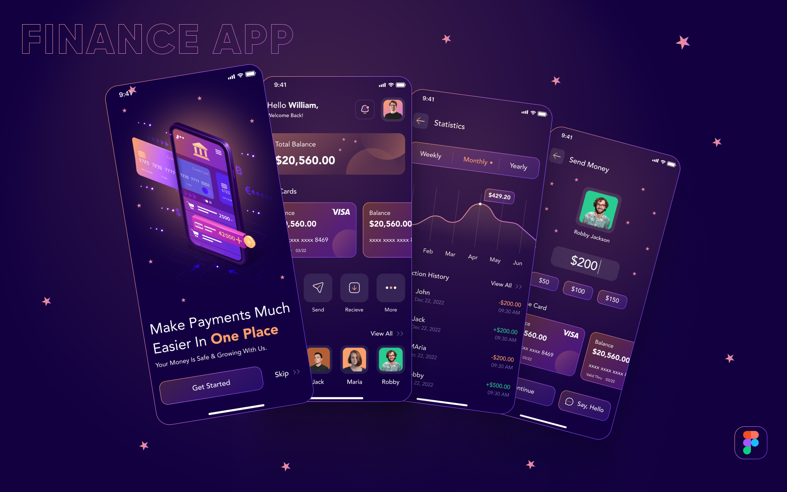

# FinanceApp 

Take control of your finances with FinanceApp, the ultimate mobile app designed to simplify your financial life. Whether you're a savvy investor, a budget-conscious individual, or just someone who wants to make smarter money decisions, FinanceApp is your go-to companion.

# Hey there :wave:

This application is based on [Figma design templates](https://www.figma.com/design/e2WF3F6FWPPZcCw4RLZ3mZ/Finance-Mobile-App?t=0ZwsPDfzzOCSoI77-0) :thumbsup: and thanks to this designer.

# App Cover Screenshots

## Get Started

install dependencies 

### `npm install` or `yarn install`

## Then

Run The app

### `npm start` or `yarn start`

Runs your app in development mode.

Open it in the [Expo app](https://expo.io) on your phone to view it. It will reload if you save edits to your files, and you will see build errors and logs in the terminal.

#### `npm run android` or `yarn run ios`

Like `npm start` / `yarn start`, but also attempts to open your app on a connected your device or emulator and the iOS Simulator if you're on a Mac and have it installed.

 

💙 If you like this project, give it a ⭐ and share it with friends :id:!
